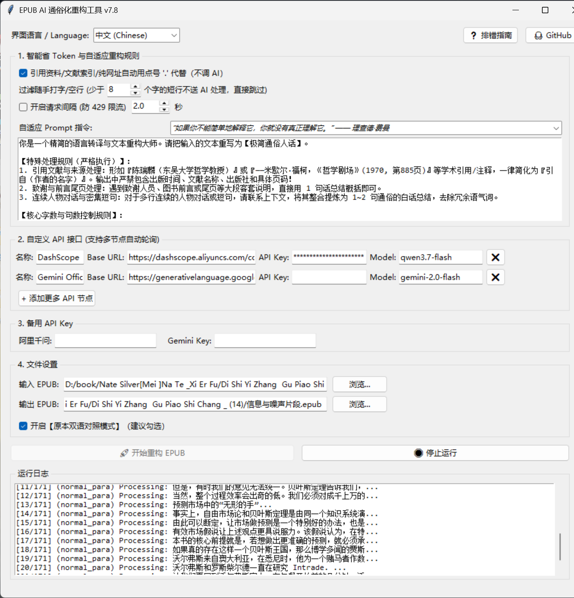
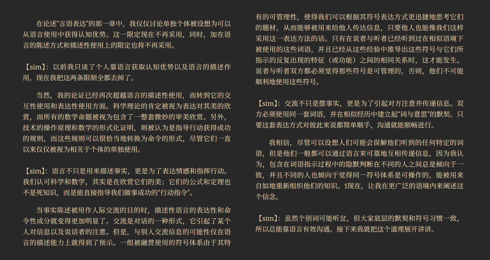
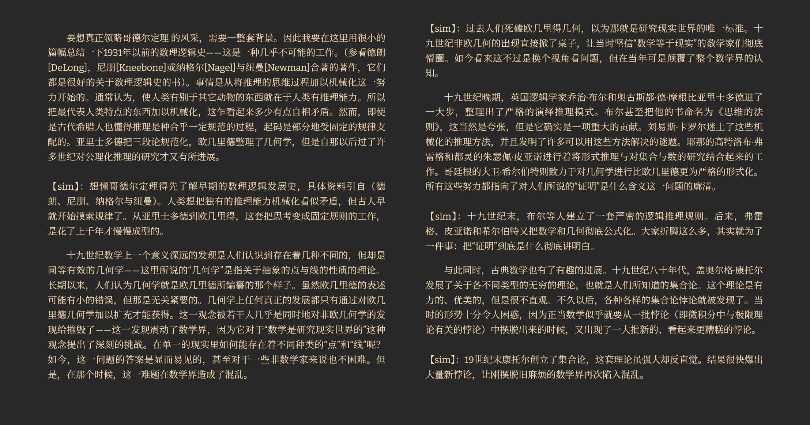
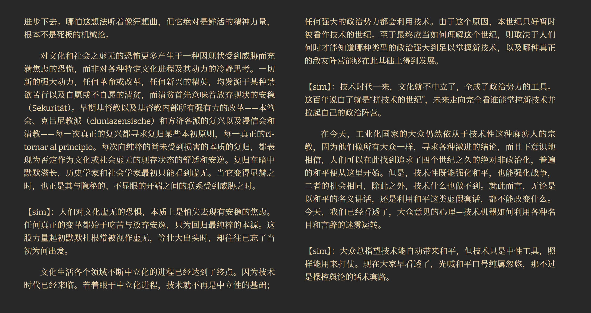

<div align="center">
  <h1>📚 SimpRead: AI-Powered EPUB Simplifier</h1>
  <p>An intelligent desktop tool that leverages LLMs to automatically rewrite complex EPUB books into easy-to-understand plain language.</p>
  <p>
    <b>English</b> | 
    <a href="README.md">简体中文</a>
  </p>
</div>

## ✨ Key Features

### MainUI


- **🧠 Intelligent Simplification**: Built-in optimized prompts transform complex academic texts and long sentences into concise, colloquial summaries.
- **⚡ Multi-Node Failover**: Supports multiple API keys/models (e.g., Qwen, Gemini). Automatically switches to the next node upon encountering rate limits (429 errors), ensuring uninterrupted processing.
- **💾 Checkpoint Resume**: Progress is automatically saved. You can resume tasks from the last breakpoint without reprocessing or wasting tokens.
- **📦 Smart Batching**: Intelligently identifies and bundles continuous dialogues or short paragraphs, optimizing context packaging to save tokens and improve coherence.
- **🛡️ Rate Limit Protection**: Built-in dynamic delay mechanisms prevent API blocks caused by sending requests too rapidly.
- **🎨 Lightweight GUI**: A clean and responsive interface built with Tkinter, requiring no complex configurations—ready to use right out of the box.

### Before and after (Personal Knowledge: Towards a Post-Critical Philosophy)


## 🚀 Quick Start

### 1. Prerequisites
Ensure you have **Python 3.8 or higher** installed on your machine.

### 2. Installation
Clone the repository and install the required dependencies:

```bash
# Clone the repository
git clone https://github.com/BenjaminDouglasJohnson/SimpRead.git
cd SimpRead

# Install dependencies
pip install -r requirements.txt

# Run the application
python main.py
. Configuration & Usage
Configure API: Launch the GUI and enter your LLM API details (Base URL, API Key, Model Name). It supports any OpenAI-compatible API (e.g., Alibaba DashScope, Google Gemini, DeepSeek).
Import EPUB: Click "Browse" to select the EPUB file you want to process.
Start Rewriting: Click the "Start" button. The tool will automatically parse, simplify, and save the new version.
⚙️ Technical Stack
GUI Framework: Python Tkinter
EPUB Processing: EbookLib, BeautifulSoup4
AI Integration: OpenAI SDK (Compatible with Alibaba Cloud Bailian, etc.)
📝 Roadmap (TODO)
Add support for more file formats (e.g., PDF, MOBI).
Optimize the logic for splitting ultra-long texts.
Implement a dark mode for the user interface.
Enhance the troubleshooting guide with more common error solutions.
⚠️ Disclaimer
This tool is intended for personal learning and research purposes only. Please ensure you have the necessary rights or permissions for the books you process. The developer is not responsible for any copyright issues arising from the use of this software.
📄 License
This project is licensed under the MIT License. See the LICENSE file for details.
```

### Before and after 2(Gödel, Escher, Bach: The Quintessence of Unity)


### Before and after 3(The Concept of Politics)

